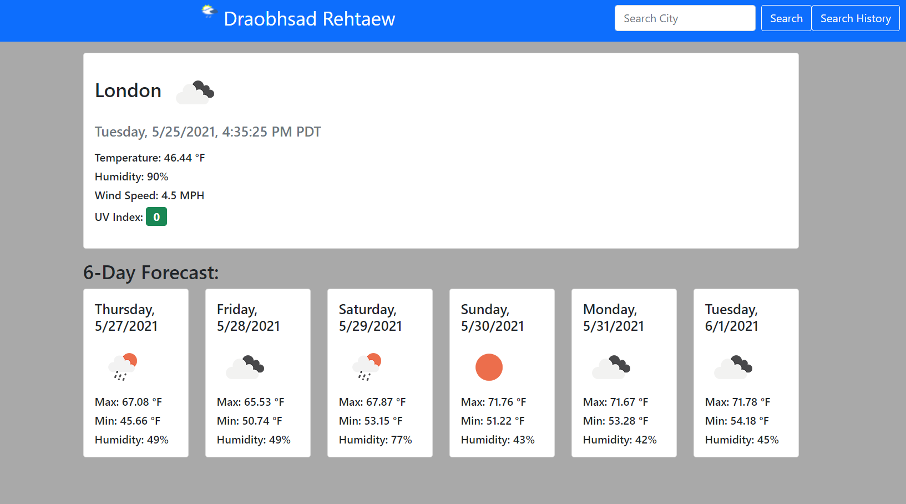
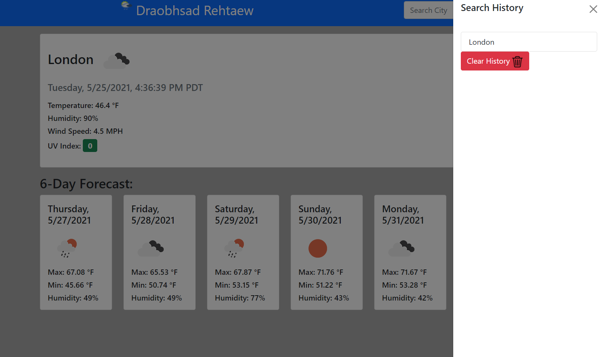

# Weather-Dashboard
small and simple weather site, using API: openweathermap.com
This site allows you to search a city and it will provide the current weather information and the 6 day forecast. 
Your seaches will then be stored in the search History via local Storage which can be accesed on future uses. Your most recent search will be pulled up when you refresh the page.

Demo can be found under the Screenshots folder.

Current Day/Forecast: 
This information is provided by the API. The page will display the current time, conditions, temperature, humidity, and UV index. The UV index will change depending on its severity: 0-3 = Green(mild) , 3-6 = Yellow(moderate) , 6-9 = Red(severe) , 9+ = Black/Dark(extreme).
The 6 day forecast will display the day, date, conditions, max/min temperatures, and humidity.

Search History:
The app will store your search history up to 20 searches. You can click the links on the search history to re search your past searches. On leaving the page, the page will store your most recent search and pull it when you revisit the page. At 20 posts the search history will start removing old searches, limiting the max to 20. You can also delete you search history with the clear history button.

The Deployed version of the page is: https://wellswu4621.github.io/Weather-Dashboard/

The Repository is: https://github.com/WellsWu4621/Weather-Dashboard